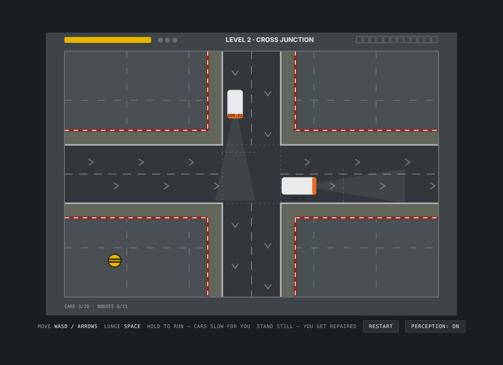
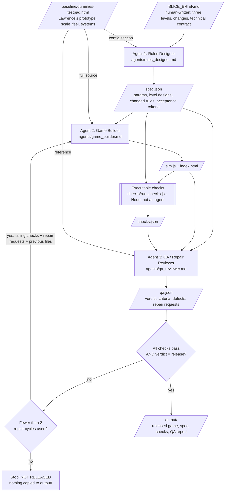

# DUMMIES — Agent Crew (ELVTR Assignment #3)

**Capstone game:** DUMMIES, by Lawrence Lek.

DUMMIES is a single-player, top-down 2D browser game for an exhibition. You are
a FARSIGHT crash-test dummy in Shenzhen Smart City, New Economic Zone, China,
20XX. *You are buying your freedom by destroying your body.* You bait
self-driving cars and lunge into their path.

## What the crew produces

A crew of three agents takes Lawrence's hand-directed prototype (the
"Testpad", `baseline/dummies-testpad.html`) and a one-page brief, and produces
a **playable three-level vertical slice of DUMMIES**, plus the specification
it was built from and an independent QA report. Cars are solid on every side. Damage is the
vehicle's speed times its mass, adjusted for which face is hit and which way
the dummy lunged. The game code has a `Vehicles` module and a `Damage`
module.

| Level | What it is |
|-------|------------|
| 1. ROAD | One road, all traffic left to right, nothing makes it stop. Lanes, a hard shoulder cars may swerve onto, and a barrier they cannot cross. The teaching level. |
| 2. CROSS JUNCTION | Two one-way roads crossing, no traffic lights, same shoulders and barriers. Cars give way to each other and never collide. |
| 3. CRASH TEST CENTRE | The open hall: vehicles from all four edges, the full twelve-unit fleet. |

Released output from the run included in this repository:

| File | Produced by | What it is |
|------|-------------|------------|
| `output/spec.json` | Rules Designer | All parameters in real-time units, the three level designs, the changed rules, 55 acceptance criteria, 24 listed differences from the GDD and the Testpad |
| `output/game/index.html`, `output/game/sim.js` | Game Builder | The playable browser game |
| `output/checks.json` | Orchestrator | Results of 36 executable checks run against the build, plus measured damage and vehicle figures for QA |
| `output/qa_report.json` | QA / Repair Reviewer | Per-criterion verdicts, defects, release decision |

**To play:** download the repository (green **Code** button, **Download ZIP**),
unzip, and open `output/game/index.html` in a browser. No server is needed.
WASD or arrow keys move (hold to run), Space lunges, any key dismisses a card.
Cars avoid you: stand where a car can't see you, or bait it into committing to
a side, then lunge across its orange nose. Only the nose pays in full.



## Architecture



`crew.py` is the orchestrator. Each agent is a **separate headless Claude Code
session** (`claude -p`) with its own system prompt, no tools and no shared
conversation. The only thing an agent knows about the others is the artifact
the orchestrator hands it.

## The agents

| Agent | Input | Output | Why it is needed |
|-------|-------|--------|------------------|
| **Rules Designer** | `SLICE_BRIEF.md` and the Testpad's config section | `spec.json`: every number converted to real-time units, the three level layouts with quota, allocation and unit pool, the certification target, exact rules for everything that changes (eased lunge and recovery, car-to-car give-way, level flow, endings), acceptance criteria | The brief says *what* changes; nobody else decides *how much* or writes it down testably. Without it the Builder would invent levels and rules and there would be nothing to test against. Covers the GDD's Ladder & Economy and Lead Architect roles. |
| **Game Builder** | `spec.json`, the technical contract and the full Testpad source; on repair also its previous files, the failing checks and QA's repair requests | `sim.js` (all rules, deterministic, no browser needed) and `index.html` (drawing and input) | The only agent that writes game code. It ports the Testpad and may not change rules or numbers. Covers the GDD's Feel and Vehicle Behaviour roles. |
| **QA / Repair Reviewer** | `spec.json`, the Builder's files, the check results, the Testpad source as reference | `qa.json`: pass / fail / unverified per acceptance criterion with evidence, defects, missing Testpad systems, verdict, targeted repair requests | GDD rule: *no agent signs off its own work.* Checks only cover rules they can measure; QA reads the code for what they cannot see and turns failures into repair requests the Builder can act on. Its verdict is one half of the release gate. Covers the GDD's QA Harness role. |

How the outputs really pass between agents:

- The check `params_match_spec` fails unless the Builder's `PARAMS` are
  identical to the Designer's 252 numbers.
- The checks measure movement, lunge, levels and endings against the
  Designer's values, not against constants in the harness.
- A build is released only if every check passes **and** QA says `release`. If
  either says no, the Builder is called again with the reasons (two repair
  cycles at most). If it still fails, the run exits with code 1 and `output/`
  is left untouched.
- This loop has run for real. In run `20261006-215228`, build 1 failed the
  deadlock check, QA wrote three repair requests, the Builder changed the
  car-to-car logic, and build 2 passed every check and QA.
- After a release, the crew takes **change requests** against the released
  build (`python crew.py --change changes/CR-xxx.md`): the Designer revises
  the specification, the Builder patches its own files, and the same checks
  and QA gate the result. `changes/` holds Lawrence's two so far.
- QA does more than read the check results. On CR-002 every check passed,
  and QA still sent the build back: it found that a hit landing on the last
  step of a lunge was scored as a standing hit. The Builder fixed it and a
  check for it was added.

## Connection to the GDD

| GDD rule | In this slice |
|----------|---------------|
| "Move in eight directions and press one button to lunge" | Yes; equal speed and equal lunge distance in all eight directions, checked |
| "Lunge travels in the facing direction without midair steering" | Yes; held direction, or facing direction if none is held |
| "A miss causes a recovery delay" | Yes, as an eased 0.35 s recovery, not a freeze (Move Refinements MR-01) |
| Vehicle classes with different avoidance | Six of the GDD's eight: sedan, van, sports, bus, wagon, hatchback (no SUV or police car) |
| Hatchback: "one signalled recommitment" | Yes |
| "The cars visibly learn" | Yes, as in the Testpad: each write-off briefs the unit that caused it |
| Detection wedge, commit line, chevron, brake lights | Yes. The chevron appears at commitment, as in the Testpad, not on detection as the GDD says |
| "Rear contact gives no damage, score" | Yes |
| "Impact value depends on class, speed and angle"; "lunge multipliers" | Damage = vehicle speed x class mass x face factor (nose 1, front corner 0.6, flank 0.25, tail 0) x lunge factor (head-on x1.8, across x1, with the car x0.2). The bus is heaviest (CR-001, CR-002) |
| Standing still triggers service | Yes, as in the Testpad: unlimited, not once per body |
| Certification by total write-offs, target above the sum of quotas | Yes: 11 bodies against quotas of 2, 3, 5 |
| Endings: Licensed, Non-compliant, Decommissioned | Yes |
| Reports voiced by vehicles, truthful to logged events | Yes: the Testpad's twelve behaviour signatures and authored lines |
| "Runtime uses seeded code, not language models" | Yes; same seed and inputs give the same run, checked |
| Environments | Three (road, cross junction, crash test centre) of the GDD's five |
| Price tiers, moods, shift analysis, art direction, audio | **Not included** |

The Designer's own list of differences is in `output/spec.json` under
`differences`.

## How to run the crew

Requirements:

- Python 3.9 or later (standard library only; nothing to `pip install`)
- Node.js 18 or later (runs the checks)
- [Claude Code](https://claude.com/claude-code) installed and signed in
  (`claude` on the PATH). The crew uses your existing Claude Code sign-in.
  **No API key is needed and none is stored in this repository.**

```
python crew.py
```

A full run makes at least three model calls and takes roughly ten to twenty
minutes; the Builder's port is the slow step. It writes every intermediate
artifact to `runs/<timestamp>/` and, if released, the final files to
`output/`. Optional: set `CREW_MODEL` to choose a model.

```
python crew.py --from-run runs/<timestamp>     # reuse that run's specification and first build
python crew.py --change changes/CR-002_logical_damage_and_modules.md   # revise the released build for one change request
node checks/run_checks.js output/game output/spec.json     # re-run only the checks
node checks/bot_playthrough.js output/game 1               # automated player, seed 1
```

## Repository layout

```
SLICE_BRIEF.md            human-written input to the crew
baseline/                 the Testpad: Lawrence's prototype, the Builder's starting point
changes/                  change requests from Lawrence, applied by the crew to the released build
crew.py                   orchestrator
agents/                   one system prompt per agent
checks/run_checks.js      executable checks (the release gate, with QA)
checks/bot_playthrough.js automated player (informational)
checks/browser_playtest.js  scripted browser playtest (needs Playwright)
runs/                     complete record of every run, including the stopped ones
output/                   released game, spec, checks and QA report
archive/                  the first version: a one-road greybox built from scratch
DECISIONS.md              decision log
MOVE_REFINEMENTS.md       log of how movement should feel
docs/                     screenshots
```

## What was actually tested

**The crew runs** (6 October 2026). Nothing here was hidden or tidied:

| Run | What happened |
|-----|---------------|
| `20261006-185615` | First version (archived): one-road greybox from scratch. Three agent calls, released on the first build, 18 of 18 checks. |
| `20261006-214051` | Rebuild from the Testpad. Designer 137 s, Builder 391 s. Build 1 passed 26 of the then 27 checks. The one failure was a **bug in the check harness** (it objected when the dummy's health rose from service repair). Stopped by the operator during QA; the check was corrected. |
| `20261006-215043` | Specification and build 1 reused. 27 of 27 checks passed. QA said `repair` with one request, about fleet learning only being credited at a write-off, which is how the Testpad behaves. Meanwhile the automated player showed that **level 2 could deadlock** and never end. Stopped by the operator during the repair call; a new check for it was added, and QA and the repair pass were given the Testpad source. |
| `20261006-215228` | **First release of the three-level build.** Specification and build 1 reused. Build 1 failed the new deadlock check (27 of 28). QA said `repair` with three targeted requests. The Builder's repair took 174 s and changed only the car-to-car logic. Build 2 passed 28 of 28 checks and QA said `release` (22 criteria pass, 3 unverified, 4 minor defects). |
| `20261006-221109` | **Change request CR-001** (solid cars, momentum damage, shoulder and barrier). The Designer revised the specification in 2 minutes; then an **orchestrator bug** in the new change mode crashed the run before the Builder was called. Fixed. |
| `20261006-221429` | Specification reused. The Builder's change pass passed 29 of 31 checks. One failure was a **bug in the check harness** (the damage check ignored a car's sideways swerve speed; the build was right). The other was real: level 2 froze again, head-on, in the oncoming lane. QA said `repair`. Stopped by the operator, who fixed the check and added an addendum to CR-001 making level 2's roads one-way. |
| `20261006-222229` | **Release of CR-001.** The Designer revised the specification for the addendum (113 s), the Builder patched the previous build (135 s), 31 of 31 checks passed on the first build and QA said `release` (31 criteria pass, 10 unverified, 2 minor defects). |
| `20261006-224618` | **Change request CR-002** (logical damage, Vehicles and Damage modules, QA audits). Designer 228 s, Builder 180 s. Build passed 33 of 34 checks; the one failure was a **bug in the check harness** (for a car travelling down the screen it called a lunge in the same direction "head-on"; the build was right). Stopped by the operator during QA; the check was corrected. |
| `20261006-225543` | **The current release**, after three builds. Build 1 (reused): 34 of 34 checks. QA's hand-calculated damage table matched the build on all 16 figures, and QA still said `repair`: it found that a hit on the last step of a lunge was scored as a standing hit, which no check covered, and that the vehicle figures the specification demands were missing from the check report. Build 2 (140 s) fixed the scoring; QA said `repair` again, only for the missing measured figures. The operator added those measurements, and a check for the last-step case, to the harness while the Builder made build 3 (134 s, one minor fix). 36 of 36 checks; QA said `release` (47 criteria pass, 8 unverified, 3 minor defects). |

**Executable checks** on the released build (run by Node against the generated
`sim.js`): 36 of 36 passed.

| Check | What it verifies | Result |
|-------|------------------|--------|
| `load_sim` | sim.js loads in Node and exports createSim, step, PARAMS | pass |
| `params_match_spec` | Builder's PARAMS equal the Designer's spec params (Designer output reached the Builder) | pass |
| `state_shape` | createSim returns the contract state shape, JSON-serialisable, for all three levels | pass |
| `attract_then_confirm` | Default start is the attract screen; a confirm press begins play | pass |
| `move_speed_equal_8_directions` | Distance covered in 1 s is equal in all eight directions (within 1%) and goes the way the input points | pass |
| `walk_frame_rate_independent` | Walking covers the same distance at 60 and 120 steps per second (within 2%) | pass |
| `run_speed_matches_spec` | After the ramp, speed equals spec runSpeed straight and diagonal (within 3%) | pass |
| `lunge_distance_equal_8_directions` | Lunge distance is equal in all eight directions (within 1%), equals spec lungeDistance (within 2%), and follows the facing direction when no direction is held | pass |
| `lunge_frame_rate_independent` | A lunge covers the same distance at 120 steps per second (within 2%) | pass |
| `lunge_eases_out` | The lunge is tweened: more than 60% of the distance is covered in the first half of its duration | pass |
| `no_midair_steering` | Direction input during a lunge does not change its path | pass |
| `held_lunge_does_not_chain` | Holding the lunge button and a direction for 3 s starts exactly one lunge | pass |
| `recovery_is_tweened` | After a lunge the dummy is 'recovering' for spec recoveryTime, can move during it, and starts slowly | pass |
| `deterministic_and_seeded` | Same seed and inputs give an identical state after 40 s; a different seed gives different traffic | pass |
| `level1_road_flows_left_to_right` | Level 1: every car travels left to right inside the road band, at its class speed, and never stalls (dummy out of the way) | pass |
| `car_speed_real_time` | An undisturbed car's reported speed equals its class speed and its real displacement per second, at 60 and 120 steps per second | pass |
| `level2_cross_no_collisions` | Level 2: traffic uses both one-way roads (left to right, top to bottom), cars never overlap inside the canvas, and traffic keeps flowing for 150 s (no deadlock) | pass |
| `level3_free_for_all` | Level 3: vehicles enter from at least three of the four edges, several classes appear, and cars never overlap inside the canvas | pass |
| `detection_commit_and_brake_flags` | A dummy standing in a lane is seen, the car commits to a side (lock) and the lock does not change afterwards | pass |
| `front_impact_pays_once` | Front contact reduces health and adds score, once per car | pass |
| `rear_contact_pays_nothing` | Rear contact changes neither health nor score | pass |
| `write_off_card_and_fresh_body` | At zero health: one write-off counted, a card appears, confirm gives a fresh body | pass |
| `level_progression` | Quota met and allocation spent: level 1 -> 2 -> 3 via a card and confirm | pass |
| `ending_decommissioned` | Allocation spent with the quota missed ends the run as 'decommissioned' | pass |
| `ending_licensed` | The write-off that reaches certificationTarget ends the run as 'licensed' at once | pass |
| `levels_always_end_with_dummy_in_traffic` | With a dummy standing on the road (at each road edge, so cars must swerve), every level still runs to its end, cars never overlap, never cross a barrier, and the dummy is never left inside a car | pass |
| `solid_cars_and_barriers_under_active_play` | With the dummy wandering across the roads and lunging for 90 s per level: cars never overlap each other, never cross a road barrier, and the dummy is never left inside a car | pass |
| `dummy_cannot_walk_through_a_car` | Cars are solid on every side: a dummy placed against a car's side, or walking into it, is pushed out and never ends up inside | pass |
| `modules_exist_and_do_the_work` | sim.js exports a Vehicles module and a Damage module; Vehicles.step alone moves the cars; Vehicles.cruiseSpeed returns the class speed | pass |
| `damage_module_is_logical` | Damage.assess follows perMomentum x vehicle speed x mass x face x lunge direction for every class, and the ordering is logical: head-on lunge pays most, lunging with the car pays less than standing still, the tail pays nothing, lunge speed does not matter | pass |
| `damage_in_play_matches_module` | In real play, each hit is scored by the Damage module and logged in state.lastImpact: standing at the nose, a head-on lunge, a diagonal lunge into the flank travelling with the car (Lawrence's bug case), and the tail | pass |
| `hit_during_any_lunge_step_counts_as_a_lunge` | A hit that lands on any step of a lunge, the final one included, is scored as a lunge (QA's finding on CR-002 build 1): swept over 200 head-on lunges started from slightly different distances | pass |
| `traffic_audit` | Vehicle paths and stop/start, measured over 120 s per level with a wandering dummy: on levels 1 and 2 no car is removed while still inside the hall and no car stays stopped for more than 15 s (level 3 is measured and reported to QA, not enforced) | pass |
| `vehicle_numbers_for_qa` | Vehicle start/stop, lane and barrier figures are measured for the QA audit; every car's speed stays between 0 and its class speed on all levels | pass |
| `sim_is_pure` | sim.js uses no Math.random, timers, clock or DOM | pass |
| `html_static` | index.html has a canvas, loads sim.js, handles the keyboard, uses a fixed timestep and makes no network requests | pass |

**Damage table** (computed by the build's own `Damage` module at each class's cruising speed; QA checked every sedan and bus figure by hand):

| Class | Speed x mass | Standing at the nose | Head-on lunge, nose | Lunge across the nose | Front corner, standing | Flank, walking in | Flank, lunging with the car | Tail |
|---|---|---|---|---|---|---|---|---|
| Sedan | 138 x 1 | 635 | 1143 | 635 | 381 | 159 | 69 | 0 |
| Van | 120 x 1.5 | 828 | 1490 | 828 | 497 | 207 | 90 | 0 |
| Sports | 192 x 0.9 | 795 | 1431 | 795 | 477 | 199 | 86 | 0 |
| Bus | 108 x 3 | 1490 | 2300 | 1490 | 894 | 373 | 162 | 0 |
| Wagon | 144 x 1.2 | 795 | 1431 | 795 | 477 | 199 | 86 | 0 |
| Hatch | 156 x 0.8 | 574 | 1033 | 574 | 344 | 144 | 62 | 0 |

A fresh body has 2300 health. "Flank, lunging with the car" is the diagonal case Lawrence reported; before CR-002 it paid the 2,300 cap and destroyed the body.

**Vehicle figures** (measured by the check harness for QA's vehicle audit):

- Lane keeping with the dummy out of the way: deviation from the lane line 0, 0, 0 px on levels 1, 2 and 3.
- Barriers, with a wandering dummy: the closest any car came was 9 px on level 1 and 3 px on level 2; none crossed.
- Starting: every class reaches cruising speed from rest in the expected time (sedan 0.383 s).
- Stopping behind a stopped car: every class stops without touching, about 7.9 px short.
- Levels 1 and 2 over 120 s x 3 seeds each: no car removed inside the hall, longest stop 0 s and 0 s.
- **Level 3 jam breaker, 30 seeds x 60 s:** with the dummy idle it deleted 3 cars in 3 of 30 runs; with the dummy wandering, 11 cars in 10 of 30 runs. The longest the oldest car was held was 19.2 s.

**Automated player** (`checks/bot_playthrough.js`, informational). It only
ambushes: it stands one lunge away from a lane and tries to land just in front
of a car's nose. It never baits and never lunges head-on.

| Seed | Level 1 (quota 2 of 14 cars) | Hits | Result |
|------|------|------|------|
| 1 | 0 bodies | 7: 6 flank, 1 nose | Decommissioned in level 1 |
| 2 | 0 bodies | 7: 5 flank, 2 nose | Decommissioned in level 1 |
| 3 | 0 bodies | 9: 6 flank, 3 nose | Decommissioned in level 1 |

**This player no longer gets past level 1.** Before CR-002 any lunge that
touched a car paid the maximum, so it passed easily. With logical damage a
flank pays 159 against a sedan and only a nose hit pays well, and this player
mostly clips flanks. The quotas were set before CR-002 and have not been
retuned; whether a person who baits and lunges head-on can meet them is
untested.

**Scripted browser playtest** (`checks/browser_playtest.js`, headless
Chromium, real key events):

- The page loaded with no errors and made no network requests.
- It opened on the attract screen; a key press started level 1.
- Holding D for 1 s moved the dummy 125 px; holding W and D for 1 s moved it
  124 px diagonally.
- Holding W and Space for 1.5 s moved it 282 px: one lunge plus walking, not
  a chain of lunges.
- Each level was opened directly and drew its layout with traffic
  (`docs/screenshot_level1.png` to `screenshot_level3.png`).

**Not tested:**

- No person has played this build yet. Feel, difficulty and whether the cues
  read for a fifteen-year-old are unverified.
- Level tuning is the Designer agent's first guess. The automated player
  results above are the only evidence about whether the quotas are fair.
- Only run on Linux with Chromium. Not tried on other browsers, on a
  high-refresh display, or on exhibition hardware.

## Known limitations

- **Difficulty is untuned after CR-002.** Hits are worth far less than
  before, the quotas are unchanged, and the automated player cannot pass
  level 1. Expect the game to be hard until quotas, allocations or health are
  retuned by playtest.
- **Two of Lawrence's instructions were interpreted, and need his
  confirmation.** "Inversely proportional to speed x mass" is built as
  directly proportional. Level 2's roads were made one-way to stop head-on
  deadlocks; he did not ask for that.
- **A jam breaker deletes cars on level 3.** If the oldest car in the hall is
  stuck for 6 s without seeing the dummy, the code removes the cars blocking
  it. Measured over 30 seeds of 60 s: 3 cars in 3 runs with the dummy idle, 11
  cars in 10 runs with it wandering. It never fired on levels 1 and 2. Level 3
  traffic still jams; the jam is cleared by deleting cars, not by the cars
  resolving it. CR-002 asked QA to report this, not fix it.
- The modules are named sections of one file (`DummiesSim.Vehicles`,
  `DummiesSim.Damage` in `sim.js`), not separate files.
- A car that cannot swerve because of the barrier or another car slows; it
  does not stop.
- QA's three minor defects are open: level 3 cars have no sideways limit and
  can swerve past the hall edge; a contact with a stopped car (zero damage)
  still counts as a hit in the report statistics; level 3 has no hall
  outline.
- The traffic behind the Testpad's attract screen is not ported.
- Agents are language models, so a re-run will produce a different
  specification and different code. The game itself is deterministic.
- The checks rely on a hand-written technical contract in the brief; the
  Designer cannot change the file layout or state shape.
- The first version of this assignment (a single-road greybox built from
  scratch, released first time with 18 of 18 checks) is kept in `archive/`
  and in `runs/20261006-185615/`.
