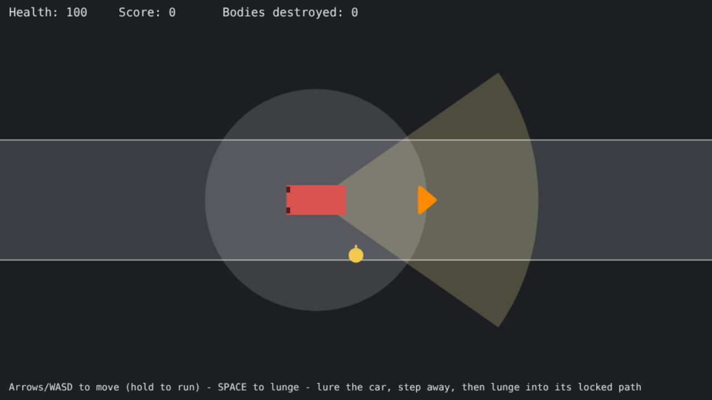
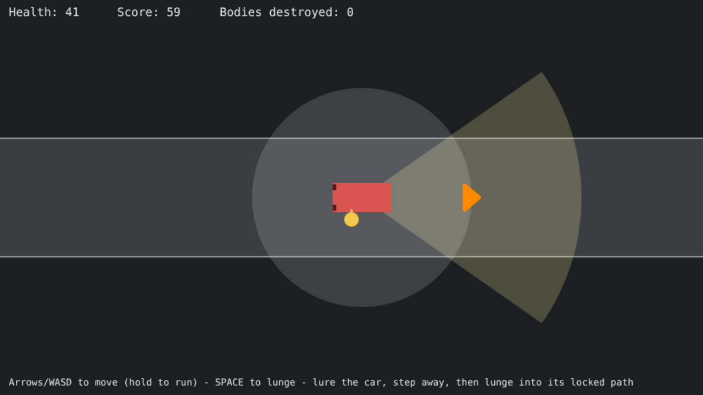

# DUMMIES — Agent Crew (ELVTR Assignment #3)

**Capstone game:** DUMMIES, by Lawrence Lek.

DUMMIES is a single-player, top-down 2D browser game for an exhibition. You are
a FARSIGHT crash-test dummy in Shenzhen Smart City, New Economic Zone, China,
20XX. *You are buying your freedom by destroying your body.* You bait
self-driving cars and lunge into their path.

## What the crew produces

A crew of three agents turns a one-page slice brief into a **playable greybox
of the game's core loop** — one road, one sedan (SED-03-001), one dummy — plus
the specification it was built from and an independent QA report.

Released output from the run included in this repository:

| File | Produced by | What it is |
|------|-------------|------------|
| `output/spec.json` | Rules Designer | Tuned parameters, behaviour rules, 28 acceptance criteria, 10 labelled simplifications |
| `output/game/index.html`, `output/game/sim.js` | Game Builder | The playable browser game |
| `output/checks.json` | Orchestrator | Results of 18 executable checks run against the build |
| `output/qa_report.json` | QA / Repair Reviewer | Per-criterion verdicts, defects, release decision |

**To play:** open `output/game/index.html` in a browser (double-click it; no
server needed). Arrow keys or WASD to move, hold to run, Space to lunge. Stand
near the lane so the car sees you, step out of its way, and when its chevron
turns orange (route locked) lunge back into its path.



## Architecture

```mermaid
flowchart TD
    BRIEF[/"SLICE_BRIEF.md<br/>human-written: slice scope, GDD rules, technical contract"/]
    D["Agent 1: Rules Designer<br/>agents/rules_designer.md"]
    SPEC[/"spec.json<br/>params, rules, acceptance criteria, simplifications"/]
    B["Agent 2: Game Builder<br/>agents/game_builder.md"]
    BUILD[/"sim.js + index.html"/]
    C{"Executable checks<br/>checks/run_checks.js (Node, not an agent)"}
    CR[/"checks.json"/]
    Q["Agent 3: QA / Repair Reviewer<br/>agents/qa_reviewer.md"]
    QA[/"qa.json<br/>verdict, criteria, defects, repair requests"/]
    GAll checks pass<br/>AND verdict = release?
    LFewer than 2<br/>repair cycles used?
    OUT[/"output/<br/>released game, spec, checks, QA report"/]
    FAIL["Stop: NOT RELEASED<br/>nothing copied to output/"]

    BRIEF --> D --> SPEC
    SPEC --> B --> BUILD
    BUILD --> C
    SPEC --> C
    C --> CR
    SPEC --> Q
    BUILD --> Q
    CR --> Q
    Q --> QA --> G
    G -- yes --> OUT
    G -- no --> L
    L -- "yes: failing checks + repair requests + previous files" --> B
    L -- no --> FAIL
```

`crew.py` is the orchestrator. Each agent is a **separate headless Claude Code
session** (`claude -p`) with its own system prompt, no tools and no shared
conversation. The only thing an agent knows about the others is the artifact
the orchestrator hands it.

## The agents

| Agent | Input | Output | Why it is needed |
|-------|-------|--------|------------------|
| **Rules Designer** | `SLICE_BRIEF.md` | `spec.json`: every number (speeds, lunge distance, wedge, commit distance, damage), dummy and car state machines, cue rules, acceptance criteria, simplifications vs the GDD | The brief says *what* the slice is; nobody else decides *how much*. Without it the Builder invents its own rules and there is nothing to test against. Covers the GDD's Ladder & Economy and Lead Architect roles for this slice. |
| **Game Builder** | `spec.json` + technical contract; on repair also its previous files, failing checks and QA repair requests | `sim.js` (deterministic logic) and `index.html` (rendering, input) | The only agent that writes game code. It may not change rules or numbers. Covers the GDD's Feel and Vehicle Behaviour roles. |
| **QA / Repair Reviewer** | `spec.json`, the Builder's files, the check results | `qa.json`: pass / fail / unverified per acceptance criterion with evidence, defects, scope violations, verdict, targeted repair requests | GDD rule: *no agent signs off its own work.* Checks only cover logic; QA reads the code for what checks cannot see (cues computed but not drawn, input bugs, excluded systems creeping in). Its verdict is one half of the release gate. Covers the GDD's QA Harness role. |

How the outputs really pass between agents:

- The check `params_match_spec` fails unless the Builder's `PARAMS` are
  identical to the Designer's numbers.
- The checks measure movement and lunge against the Designer's values, not
  against constants in the harness.
- A build is released only if every check passes **and** QA says `release`. If
  either says no, the Builder is called again with the reasons (two repair
  cycles at most). If it still fails, the run exits with code 1 and `output/`
  is left untouched.

## Connection to the GDD

The GDD describes a much larger game and a fourteen-role production
architecture. This crew is a deliberately small version of it.

| GDD rule | In this slice |
|----------|---------------|
| "Move in eight directions and press one button to lunge" | Yes; equal speed and equal lunge distance in all eight directions |
| "Lunge travels in the facing direction without midair steering; a miss causes a recovery delay" | Yes |
| Sedan: "Swerves with moderate clearance" / "Intercept its locked route" | Yes; the only vehicle |
| Wedge, chevron on detection, commit ring where the route locks, brake lights | Yes |
| "Rear contact gives no damage, score"; one impact per contact episode | Yes |
| "Two ordinary head-on hits destroying a fresh body" (provisional target) | Yes, with the Designer's numbers |
| "Runtime uses seeded code, not language models" | Yes; `sim.js` is deterministic |
| Damage by class, speed and angle; overkill and write-off bonuses | **Simplified** greybox formula |
| Other vehicle classes, fleet learning, moods, service, shifts, quotas, certification, endings, barks and reports, art, audio | **Not included** |

The full list of simplifications, written by the Designer agent, is in
`output/spec.json` under `simplifications_vs_gdd`.

## How to run the crew

Requirements:

- Python 3.9 or later (standard library only; nothing to `pip install`)
- Node.js 18 or later (runs the checks)
- [Claude Code](https://claude.com/claude-code) installed and signed in
  (`claude` on the PATH). The crew uses your existing Claude Code sign-in.
  **No API key is needed and none is stored in this repository.**

```
python crew.py
```

A run takes roughly five minutes and makes at least three model calls. It
writes every intermediate artifact to `runs/<timestamp>/` and, if released,
the final files to `output/`. Optional: set `CREW_MODEL` to choose a model.

To re-run only the checks against the released build:

```
node checks/run_checks.js output/game output/spec.json
```

## Repository layout

```
SLICE_BRIEF.md            human-written input to the crew
crew.py                   orchestrator
agents/                   one system prompt per agent
checks/run_checks.js      executable checks (Node)
checks/browser_playtest.js  optional scripted browser playtest (needs Playwright)
runs/20261006-185615/     complete record of the submitted run
output/                   released game, spec, checks and QA report
DECISIONS.md              decision log
docs/                     screenshots
```

## What was actually tested

**The crew run** (`runs/20261006-185615/`, 6 October 2026): three agent calls,
all completed; released on the first build with no repair cycle.

| Step | Result |
|------|--------|
| Rules Designer | 146.5 s; specification with 28 acceptance criteria |
| Game Builder | 70.8 s; `sim.js` (328 lines) and `index.html` (201 lines) |
| Executable checks | 18 of 18 passed |
| QA / Repair Reviewer | 55.2 s; verdict `release`; 26 criteria pass, 2 unverified, 3 minor defects, 0 repair requests |

**Executable checks** (run by Node against the generated `sim.js`):

| Check | What it verifies | Result |
|-------|------------------|--------|
| `load_sim` | sim.js loads in Node and exports createSim, step, PARAMS | pass |
| `params_match_spec` | Builder's PARAMS equal the Designer's spec params (Designer output reached the Builder) | pass |
| `state_shape` | createSim returns the contract state shape and is JSON-serialisable | pass |
| `move_speed_equal_8_directions` | Distance covered in 1 s is equal in all eight directions (within 1%) and travels the way the input points | pass |
| `run_speed_matches_spec` | After accelerating, speed equals spec runSpeed in cardinal and diagonal directions (within 2%) | pass |
| `lunge_distance_equal_8_directions` | Lunge distance is equal in all eight directions (within 1%) and equals spec lungeDistance (within 2%) | pass |
| `no_midair_steering` | Direction input during a lunge does not change its path | pass |
| `miss_recovery_delay` | A missed lunge is followed by a recovery period with no movement, then control returns | pass |
| `deterministic` | Same seed and same inputs give an identical state after 30 s | pass |
| `traffic_cruises_and_respawns` | An undetected sedan cruises left to right with no route chevron, leaves, and another appears | pass |
| `detect_commit_brake_and_avoid` | A dummy standing in the lane is detected (chevron appears), the route locks at commitment, brake lights show while slowing, and the sedan swerves past without contact | pass |
| `route_locked_against_bait` | After commitment, moving the dummy does not change the locked route (the bait works) | pass |
| `front_impact_damage_once` | A front impact reduces health and adds score exactly once per contact episode | pass |
| `single_impact_per_episode` | Staying in contact does not apply damage every frame | pass |
| `rear_contact_no_damage` | Contact with the rear of the car gives no damage and no score | pass |
| `destruction_and_fresh_body` | Repeated front impacts destroy the body once, then a fresh body with full health appears | pass |
| `sim_is_pure` | sim.js uses no Math.random, timers, clock or DOM | pass |
| `html_static` | index.html has a canvas, loads sim.js, handles the keyboard and makes no network requests | pass |

**Scripted browser playtest** (`checks/browser_playtest.js`, headless Chromium,
real key events): the page loaded with no errors; the script walked the dummy
to the lane edge, waited for the sedan to commit and lunged. Four lunges, four
hits: health 100 to 41.2 to 0, two bodies destroyed and replaced, score 200.



**Not tested:**

- No person has playtested it yet. Whether a fifteen-year-old reads the
  chevron lock and brake lights is unverified (QA marked AC-28 `unverified`).
- The repair loop did not trigger in the submitted run, because the first
  build passed. The loop is implemented in `crew.py` but has not been
  exercised by a real failing build.
- Only run on Linux with Chromium. Not tried on other browsers or on
  exhibition hardware.

## Known limitations

- Greybox only: flat shapes, no art direction, no audio.
- QA's three minor defects are open: the dummy can briefly leave the world
  rectangle mid-lunge at an edge; a Space tap shorter than one frame can be
  missed; a hand-built invalid car state could throw.
- The Designer's spec contradicts itself about edge clamping during a lunge
  (AC-24, marked `unverified` by QA).
- Agents are language models, so a re-run will produce a different
  specification and different code. The game itself is deterministic.
- The checks rely on a hand-written technical contract in the brief; the
  Designer cannot change the file layout or state shape.
- The crew builds one slice. It does not yet cover the GDD's other eleven
  production roles.
